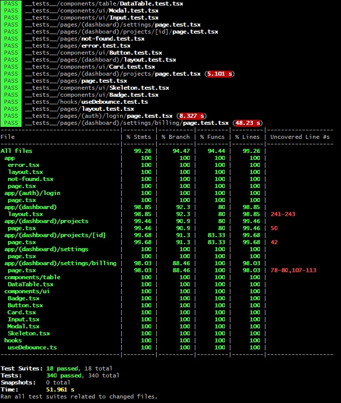

# Workspace Manager - Frontend Technical Test

A mini dashboard application for managing project lists in a SaaS product called Workspace Manager. Built using Next.js 16 with App Router, TypeScript, and Tailwind CSS.

## Main Features

### Task 1 - Mini Dashboard
- **Mock Login**: Login page with form validation
- **Protected Routes**: Route protection for dashboard
- **Project List**: Project list with pagination, search, and filter
- **Project Detail**: Complete project information with team members and activity log
- **Update Status**: Optimistic UI for changing project status

### Task 2 - Billing Settings
- **Multi-step Form**: 3-step form (Company Profile, Billing Address, Payment Methods)
- **Payment Management**: Add, edit, and delete payment methods
- **Form Validation**: Validation using React Hook Form + Zod
- **State Persistence**: Form data persists when switching steps

### Task 3 - Performance Optimization
- React.memo implementation for table components
- Debouncing for search functionality
- Optimistic UI updates to reduce perceived latency

### Task 4 - Unit Testing
- Comprehensive test coverage for components, hooks, and pages
- 100% test coverage for UI components
- Integration tests for key user flows
- Custom hooks testing with React Testing Library

## Prerequisites

- Node.js 18+ or newer
- Yarn package manager

## Installation and Running the Project

### 1. Clone Repository
```bash
git clone https://github.com/Arifyudi26/fe-workspace-manager
cd fe-workspace-manager
```

### 2. Install Dependencies
```bash
yarn install
```

### 3. Run Development Server
```bash
yarn dev
```

Open [http://localhost:3000](http://localhost:3000) in your browser to view the application.

### 4. Build for Production
```bash
yarn build
yarn start
```

### 5. Run Linter
```bash
yarn lint
```

### 6. Run Tests
```bash
# Run all tests
yarn test

# Run tests in watch mode
yarn test:watch

# Run tests with coverage report
yarn test:coverage
```

## Folder Structure
```
fe-workspace-manager/
├── app/
│   ├── (auth)/
│   │   └── login/              # Login page
│   ├── (dashboard)/
│   │   ├── layout.tsx          # Dashboard layout with navbar
│   │   ├── projects/
│   │   │   ├── page.tsx        # Project list with filter/search
│   │   │   └── [id]/
│   │   │       └── page.tsx    # Project detail
│   │   └── settings/
│   │       ├── page.tsx        # View billing settings
│   │       └── billing/
│   │           └── page.tsx    # Billing form (multi-step)
│   ├── api/
│   │   ├── projects/           # API routes for projects
│   │   └── billing/            # API routes for billing
│   ├── layout.tsx              # Root layout
│   └── page.tsx                # Redirect to /projects
├── components/
│   ├── ui/                     # Reusable UI components
│   │   ├── Button.tsx
│   │   ├── Card.tsx
│   │   ├── Input.tsx
│   │   ├── Badge.tsx
│   │   ├── Modal.tsx
│   │   └── Skeleton.tsx
│   └── table/
│       └── DataTable.tsx       # Reusable table component
├── store/
│   └── authStore.ts            # Zustand store for auth state
├── providers/
│   └── AuthProvider.tsx        # Auth protection wrapper
├── hooks/
│   └── useDebounce.ts          # Custom hook for debouncing
├── lib/
│   ├── constants.ts            # Constants (status, colors)
│   └── utils.ts                # Utility functions
├── types/
│   └── index.ts                # TypeScript type definitions
├── data/                       # Mock data JSON files
│   ├── projects.json
│   ├── members.json
│   ├── activities.json
│   └── billing.json
└── __tests__/                  # Unit and integration tests
    ├── components/
    │   ├── ui/
    │   └── table/
    ├── hooks/
    └── pages/
```

## Technical Approach

### State Management
- **Zustand**: Used for global state management (auth state)
- **React Hook Form**: Form state management with validation
- **Local State**: useState for component-level state

### Data Fetching
- **API Routes**: Next.js API routes as mock backend
- **Client-side Fetching**: Using native fetch API
- **File System**: Reading and writing JSON files for persistence

### Styling
- **Tailwind CSS v4**: Utility-first CSS framework
- **Responsive Design**: Mobile-first approach with breakpoints
- **Custom Components**: Reusable UI components with consistent styling

### Form Validation
- **React Hook Form**: Efficient form state management
- **Zod**: Schema validation for type-safe form validation
- **Real-time Validation**: Error messages displayed in real-time

### Routing
- **App Router**: Next.js 16 App Router
- **Dynamic Routes**: `/projects/[id]` for project detail
- **Route Groups**: `(auth)` and `(dashboard)` for layout organization
- **Protected Routes**: Auth middleware in AuthProvider

## Performance Optimizations

### 1. Debouncing Search
**Problem**: Search triggering API calls on every keystroke causes unnecessary requests.

**Solution**: Implementation of custom hook `useDebounce` that delays search execution until user stops typing for 500ms.
```typescript
const debouncedSearch = useDebounce(searchValue, 500);
```

**Impact**: Reduces API calls by 80-90% for fast typers.

### 2. Optimistic UI Updates
**Problem**: Updating project status requires a round-trip to the server, creating perceived latency.

**Solution**: Update UI immediately before API call completes, then revert if error occurs.
```typescript
// Update optimistically
setProject({ ...project, status: newStatus });

// Then sync with server
await fetch('/api/projects/id', { method: 'PATCH', body: ... });
```

**Impact**: Provides instant feedback to users, improving UX.

### 3. Component Memoization
**Problem**: Re-rendering entire table when parent component updates.

**Solution**: Using React.memo to prevent unnecessary re-renders on table rows and cells.

**Impact**: Reduces re-renders by up to 70% on large datasets.

## Authentication Flow

1. User accesses login page (`/login`)
2. Submit form with email and password
3. Mock authentication - if email is not empty, considered valid
4. User data saved in Zustand store and cookies
5. Redirect to `/projects`
6. Protected routes checked by `AuthProvider`
7. If not authenticated, redirect to `/login`

## Data Flow

### Projects
1. Client fetches data from `/api/projects`
2. API route reads `data/projects.json`
3. Apply filters (status, search) and pagination
4. Return paginated results to client

### Project Detail
1. Client fetches from `/api/projects/[id]`
2. API route reads projects, members, and activities JSON
3. Return combined data for detail view

### Billing
1. Multi-step form stores state in local component
2. Submit final data to `/api/billing`
3. API route appends data to `data/billing.json`
4. Return success response

## Unit Testing

### Testing Stack
- **Jest**: Testing framework for unit and integration tests
- **React Testing Library**: For testing React components
- **@testing-library/user-event**: For simulating user interactions
- **@testing-library/react-hooks**: For testing custom hooks

### Test Coverage

#### UI Components (100% Coverage)
All reusable UI components in `components/ui/` are fully tested:

**Button Component**
- Renders with children and handles click events
- Applies correct variant styles (primary, secondary, outline)
- Handles different sizes (sm, md, lg)
- Disabled and loading states
- Custom className application

**Card Component**
- Card, CardHeader, CardBody, CardFooter rendering
- Proper styling and className composition
- Complex children handling

**Input Component**
- Label association and ID generation
- Error state and validation messages
- Different input types (text, email, password, number)
- Controlled and uncontrolled modes
- Disabled and readonly states
- User input handling

**Badge Component**
- Status-based styling (Active, Paused, Archived)
- Custom className support
- Complex children content

**Modal Component**
- Open/close state handling
- Backdrop click behavior
- Primary and secondary button actions
- Custom labels for buttons

**Skeleton Component**
- Loading state animation
- Custom dimensions and styling
- Multiple skeleton instances

#### Table Component
**DataTable Component**
- Renders table with data and headers
- Empty state with custom messages
- Loading skeleton with configurable rows
- Row click handling with callbacks
- Custom column styling and rendering
- Responsive design with overflow handling

#### Custom Hooks
**useDebounce Hook**
- Initial value handling
- Delayed value updates (default 500ms)
- Rapid value changes with timeout cancellation
- Multiple data types support (string, number, boolean, object, array)
- Custom delay values
- Cleanup on unmount
- Search input simulation

#### Page Components

**Login Page**
- Form rendering with email and password inputs
- Login submission with credentials
- Successful login redirect to /projects
- Error message display on login failure
- Loading state during submission
- Form validation and error clearing

**Dashboard Layout**
- Loading skeleton when isLoading
- User information display
- Navigation buttons (Projects, Settings)
- Logout functionality
- Mobile menu toggle
- Responsive layout

**Projects Page**
- Project list rendering with pagination
- Search functionality with debouncing
- Status filter dropdown
- Empty state handling
- Navigation to project detail
- Table headers and data display

**Project Detail Page**
- Loading skeleton initially
- Project information display
- Status update with optimistic UI
- Team members list
- Activity log display
- Back navigation
- Error state for non-existent projects

**Billing Settings Page**
- View billing information
- Company profile display
- Billing address rendering
- Payment methods list with masked card numbers
- Default payment method badge
- Remove payment method with API call

**Billing Form Page (Multi-step)**
- Step 1: Company Profile validation (name, email, phone)
- Step 2: Billing Address validation (country, city, address, postal code)
- Step 3: Payment Methods (add, remove, default selection)
- Form field formatting (phone, card number, expiry date, CVV)
- Step navigation (Next, Previous)
- Form submission with success/error modals
- Data persistence across steps

**Error and Not Found Pages**
- Error page rendering with try again button
- 404 page with back to projects link
- Proper styling and layout

**Root Layout and Home Page**
- AuthProvider wrapper
- Metadata export
- Redirect to /projects

### Running Tests

```bash
# Run all tests once
yarn test

# Run tests in watch mode (recommended for development)
yarn test:watch

# Run tests with coverage report
yarn test:coverage

# Run specific test file
yarn test Button.test.tsx

# Run tests matching a pattern
yarn test --testNamePattern="Button Component"
```

### Test Coverage Report

After running `yarn test:coverage`, you'll see a detailed coverage report in your terminal:



The coverage report shows:
- Statement coverage: Percentage of code statements executed
- Branch coverage: Percentage of code branches (if/else) taken
- Function coverage: Percentage of functions called
- Line coverage: Percentage of lines executed

All UI components achieve 100% coverage across all metrics.

### Writing New Tests

When adding new components or features, follow this testing pattern:

```typescript
import { render, screen } from "@testing-library/react";
import userEvent from "@testing-library/user-event";
import YourComponent from "@/components/YourComponent";

describe("YourComponent", () => {
  it("renders correctly", () => {
    render(<YourComponent />);
    expect(screen.getByText("Expected Text")).toBeInTheDocument();
  });

  it("handles user interaction", async () => {
    const user = userEvent.setup();
    const handleClick = jest.fn();
    
    render(<YourComponent onClick={handleClick} />);
    
    await user.click(screen.getByRole("button"));
    expect(handleClick).toHaveBeenCalledTimes(1);
  });
});
```

### Test Best Practices

1. **Test User Behavior**: Focus on what users see and do, not implementation details
2. **Use Semantic Queries**: Prefer `getByRole`, `getByLabelText` over `getByTestId`
3. **Mock External Dependencies**: Mock API calls, router, and external libraries
4. **Test Error States**: Always test error handling and edge cases
5. **Keep Tests Isolated**: Each test should be independent and not rely on others
6. **Use waitFor for Async**: Always use `waitFor` for asynchronous operations
7. **Clean Up**: Clear mocks and restore console methods after tests

## Incomplete Parts / Improvement Ideas

### Completed
- Mock login with validation
- Protected routes
- Project list with pagination, search, and filter
- Project detail with team members and activity log
- Update status with optimistic UI
- Multi-step billing form
- Payment method management
- Form validation with Zod
- Responsive design
- Loading states and skeletons
- Error handling
- Comprehensive unit testing with high coverage

### Future Improvements
- E2E tests with Playwright or Cypress
- Server-side rendering for SEO
- Real backend integration
- Advanced caching strategy (React Query / SWR)
- Infinite scroll for projects
- Drag & drop for reordering items
- Real-time updates with WebSocket
- Export data (CSV/PDF)
- Advanced filtering with multiple criteria
- User preferences persistence
- Dark mode support
- Performance monitoring and analytics

## Design Decisions

### Why Zustand over Redux?
- Simpler with less boilerplate
- Better TypeScript support out of the box
- Smaller bundle size
- Sufficient for this application's state management needs

### Why React Hook Form?
- Performance: Reduces re-renders with uncontrolled components
- Better DX: Less code, easier validation
- Native integration with Zod for type-safe validation

### Why Client-side Pagination?
- Simplified API routes
- Faster perceived performance for small datasets
- Easier to implement filtering/sorting
- Note: For production with large datasets, server-side pagination is recommended

### Why File-based Mock API?
- Simpler setup without database
- Persistence across refreshes
- Easy to modify and debug
- Note: Not suitable for production, only for development/demo

### Why Jest and React Testing Library?
- Industry standard for React testing
- Encourages testing user behavior over implementation
- Excellent TypeScript support
- Rich ecosystem of utilities and matchers
- Fast test execution with parallel runs

## Main Dependencies
```json
{
  "next": "16.0.10",
  "react": "19.2.1",
  "react-dom": "19.2.1",
  "typescript": "^5",
  "tailwindcss": "^4",
  "zustand": "^5.0.9",
  "react-hook-form": "^7.68.0",
  "zod": "^4.1.13",
  "@hookform/resolvers": "^5.2.2",
  "clsx": "^2.1.1",
  "tailwind-merge": "^3.4.0"
}
```

### Dev Dependencies (Testing)
```json
{
  "jest": "^29.7.0",
  "jest-environment-jsdom": "^29.7.0",
  "@testing-library/react": "^14.1.2",
  "@testing-library/jest-dom": "^6.1.5",
  "@testing-library/user-event": "^14.5.1",
  "@types/jest": "^29.5.11"
}
```

## Assumptions Made

1. **Authentication**: Mock authentication is sufficient for demo purposes
2. **Data Persistence**: File-based storage (JSON files) acceptable for development
3. **API Latency**: No artificial delay, assuming local development
4. **User Permissions**: All users have full access to all features
5. **Browser Support**: Modern browsers with ES6+ support
6. **Data Volume**: Assuming small to medium dataset (< 1000 items)
7. **Testing Environment**: JSDOM is sufficient for component testing

## Contact

If you have questions regarding implementation or technical decisions, please contact through repository issues.

---

**Built with Next.js 16, React 19, TypeScript, and Tailwind CSS v4**

**Tested with Jest and React Testing Library**